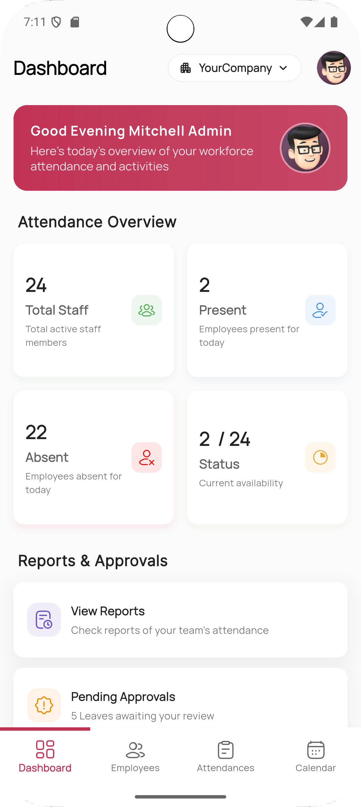
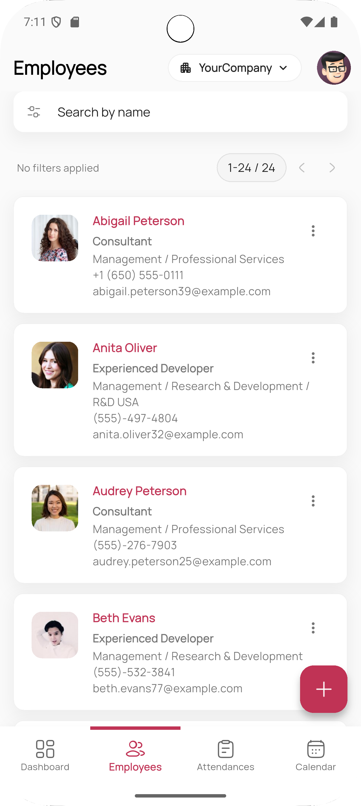
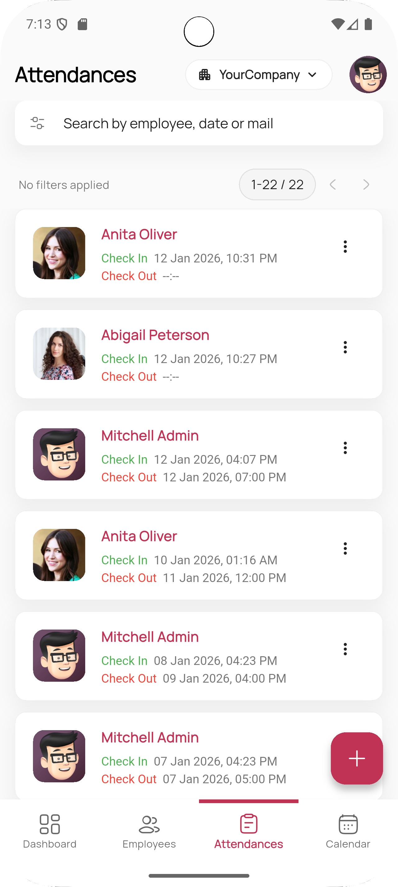
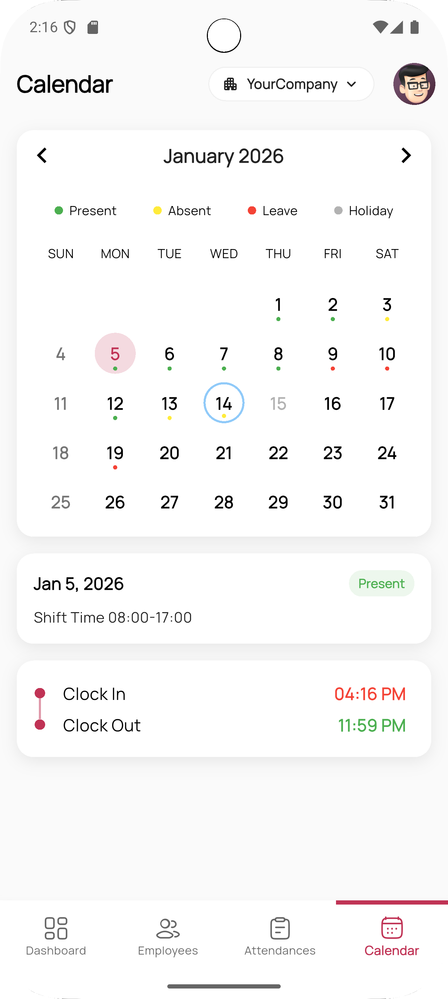

# Mobo Attendance


Mobo Attendance is a mobile application designed to extend Odoo Attendance and Employee Management
functionality to Android and iOS devices. It enables organizations to manage employee attendance,
check-in/check-out records, and workforce tracking directly from mobile devices, ensuring real-time
visibility and productivity on the go.

## Key Features

### Comprehensive Attendance Management

- **Real-Time Attendance Tracking**: Monitor employee check-in and check-out activities across
  multiple locations instantly.
- **Attendance Logs & History**: Access complete attendance records with pagination support for
  large datasets.
- **Working Duration Tracking**: Accurate stopwatch-based working time calculation.
- **Advanced Filtering & Search**: Quickly locate attendance records using domain filters and search
  tools.

### Employee & Organization Management

- **Employee Profile Management**: View and edit employee profiles with synchronized employee
  details and profile images.
- **Multi-Company Support**: Easily switch between multiple company databases.
- **Role-Based Access Control**: Dynamic access based on user roles and permissions.
- **Dynamic Access Management**: Features adapt based on user authorization levels.

### Authentication & Security

- **Secure Login**: Session-based authentication with database selection support.
- **Two-Factor Authentication Support**: Enhanced security with optional 2FA support.
- **Switch Account Functionality**: Seamlessly switch between multiple user accounts.
- **Session Persistence**: Automatic session restore using local storage.
- **Biometric Authentication**: Secure and fast login using fingerprint or Face ID (if enabled).

### Performance & User Experience

- **Dark & Light Theme Support:**: Optimized UI for different lighting conditions.
- **Localization Support**: Multi-language support using localization framework.
- **User-Friendly Error Handling**: Clear feedback for authentication, network, and sync issues.

## Screenshots

<div>
  
  
  
  
</div>

## Technology Stack

Mobo Attendance is built using modern technologies to ensure reliability and performance:

- **Frontend**: Flutter (Dart)
- **Architecture**: Provider / BLoC / Clean Architecture
- **Backend Integration**: Odoo APIs / RPC
- **Navigation**: GoRouter
- **Authentication**: Local Auth (Biometrics) & Odoo Session Management

## Getting Started

### Prerequisites

- Flutter SDK (Latest Stable)
- Odoo Instance (v14 or higher recommended)
- Android Studio or VS Code

### Installation

1. **Clone the repository**
   ```bash
   git clone https://github.com/mobo-open-source/mobo_attendance.git
   cd mobo_attendance
   ```

2. **Install dependencies**
   ```bash
   flutter pub get
   ```

3. **Run the application**
   ```bash
   flutter run
   ```

## Configuration

1. **Server Connection**: Upon first launch, enter your Odoo server URL and database name.
2. **Authentication**: Log in using your Odoo credentials. Biometric login can be enabled from
   settings.

## License

See the [LICENSE](LICENSE) file for the main license and [THIRD_PARTY_LICENSES.md](THIRD_PARTY_LICENSES.md) for details on included dependencies and their respective licenses.

##  Maintainers
**Team Mobo at Cybrosys Technologies**
- Email: [mobo@cybrosys.com](mailto:mobo@cybrosys.com)
- Website: [cybrosys.com](https://www.cybrosys.com)
